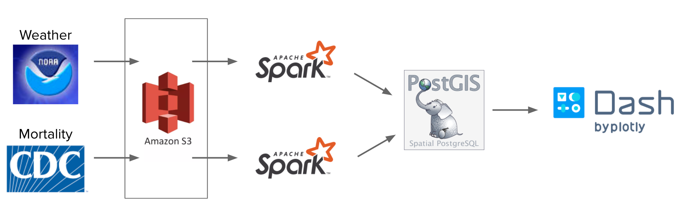

# Heatwave
_Protecting populations from extreme temperatures_

By Romain Fardel

A project created for the 
[Insight Data Engineering Fellowship](https://insightfellows.com/), 
Fall 2020 session (20C)

## Introduction

Heatwave can be deadly for populations. For instance, 
over 30,000 people died from the heatwave that swept Europe 
during the summer 2003. The issue affects the whole world, 
and the problem will keep increasing with global warming. 

To protect populations, researchers need to study 
how mortality is affected by temperature. 
The problem is that there is currently not a single source of 
data available to researchers. 
For the US, researchers need to retrieve vital statistics 
from the CDC and historical weather data from NOAA. 
Combining these datasets in challenging for a few reasons:

- **Geographical mismatch**: mortality is reported by county, 
whereas temperature is reported by weather station.

- **Temporal mismatch**: mortality is reported by day or by month, 
where temperature is reported at variable intervals depending 
on the data year and station location.

- **Schema evolution**: the format of mortality data evolves every few years, 
and data is provided in a non-delimited format, 
where knowledge of the position of each field is needed to extract the data.

- **County evolution in time**: county limits have changed over the last 50 years.

This project addresses that need by creating a pipeline 
to combine these datasets and make them available in a GIS-enabled (Geographic Information System) database 
that the end user can query with SQL.

## Execution

1. Raw data is stored in Amazon S3
    - Weather data is readily available in a NOAA bucket
    - Mortality data is ingested by FTP download, unzipping and saving 
    text files to S3
1. Raw data is processed in Apache Spark. Each dataset is extracted, 
filtered, and aggregated separately
1. Data is loaded to PostgreSQL with the PostGIS extension
1. Auxillary datasets (weather station, county definitions) are loaded to PostGIS and the data is joined
1. Final table is queried on demand and displayed in Dash.

## Data sources

### Weather

